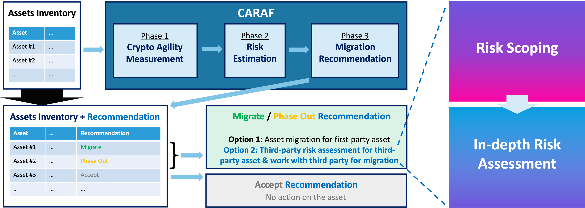

# PQTRACK – Post‑Quantum Third‑Party Risk Assessment & Compliance Kit

---

**PQTRACK** is a PQC‑aware extension to existing third‑party risk assessment processes within the CARAF framework, designed to surface long‑term cryptographic dependencies that are not fully captured by data‑centric risk models. PQTRACK is designed with the following objectives:

- Enable **PQC‑aware risk assessment** across third‑party products and services
- Integrate seamlessly with **industry‑standard third‑party risk assessment workflows**, including inherent *risk scoping* and *in‑depth risk assessments*
- Support **phased alignment of third‑party engagements** with NIST post‑quantum cryptography standards and migration guidance

---

## Purpose

- Establish a **consistent and coherent approach** to identifying PQC risk in third‑party engagements
- Guide **PQC‑aware assessment and prioritization** within existing third‑party risk assessment processes
- Support **informed, risk‑based decisions** across the third‑party engagement lifecycle

---

## Contents

- [**Overview**](01-overview.md): Quantum threat context and PQC fundamentals
- [**Industry Landscape & PQC Gaps**](02-landscape-and-gaps.md): Current industry readiness and common third‑party gaps
- [**Third‑Party Categories Relevant to PQC**](03-third-party-categories.md): Trust anchors, platforms, and data‑handling services
- [**PQC Requirements & Migration Phases**](04-pqc-requirements.md): Detailed PQC readiness criteria rolled out in phases
- [**Operationalizing PQC‑Aware Third‑Party Risk Assessment**](05-operationalization.md): Integrating PQC considerations into inherent risk assessment and security assurance workflows
